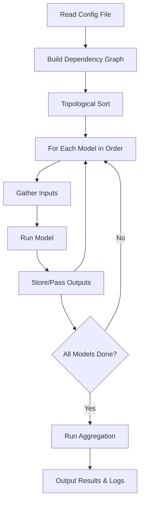

# RADF Orchestrator Logic & Flow — Detailed Design

## Purpose
The orchestrator is the "brain" of the RADF. It reads the scenario configuration, builds the dependency graph, runs models in the correct order, passes outputs as needed, and manages errors and logging.

---

## 1. Inputs & Outputs
- **Inputs:**
  - Scenario configuration file (YAML/JSON)
    - List of models to run
    - Dependency mapping (which model depends on which)
    - Aggregation instructions
    - Scenario parameters
- **Outputs:**
  - Aggregated results (JSON, CSV, etc.)
  - Audit logs (all actions, errors, results)
  - Status reports (success/failure, error details)

---

## 2. Main Responsibilities
- Parse the scenario config file.
- Build a dependency graph (DAG) of models.
- Topologically sort the graph to determine execution order.
- For each model:
  - Gather required inputs (from config or previous model outputs).
  - Run the model (call its API or Python interface).
  - Store and pass outputs as needed.
- After all models run, trigger aggregation as specified.
- Log all actions, errors, and results for auditability.

---

## 3. Flow Diagram



---

## 4. Error Handling
- If a model fails:
  - Log the error with context (model, inputs, error message)
  - Optionally retry (configurable)
  - If critical, halt the workflow and report failure
- If a dependency is missing:
  - Log and halt with a clear error message

---

## 5. Logging & Audit
- Every action (model run, aggregation, error) is logged with:
  - Timestamp
  - User (if available)
  - Model name
  - Inputs/outputs (summarized)
  - Status (success/failure)
- Logs are exportable for audit and compliance.

---

## 6. Extensibility
- New models can be added by updating the config and ensuring they implement the required interface.
- New dependency types or aggregation methods can be added without changing the orchestrator core logic.

---

## 7. Example Config (YAML)

```yaml
scenario_name: "Portfolio Stress Test"
models:
  - name: HullWhiteOneFactor
    id: hw1f
    params:
      num_paths: 1000
      time_horizon: 1.0
  - name: MertonModel
    id: merton
    depends_on: [hw1f]
    params:
      num_paths: 1000
      time_horizon: 1.0
aggregation:
  method: VaR
  models: [hw1f, merton]
  confidence_level: 0.99
```

---

## 8. Interfaces
- **Orchestrator class** (Python):
  - `run(config_path: str) -> dict`
  - `parse_config(config_path: str) -> dict`
  - `build_dependency_graph(config: dict) -> DAG`
  - `execute_models(dag: DAG, config: dict) -> dict`
  - `run_aggregation(results: dict, config: dict) -> dict`
  - `log_action(action: str, details: dict)`

---

## 9. Review Checklist
- [ ] Does the orchestrator logic meet your expectations for flexibility, auditability, and error handling?
- [ ] Is the flow clear and extensible for future needs?
- [ ] Is the config structure user-friendly and powerful enough for your scenarios?

---
